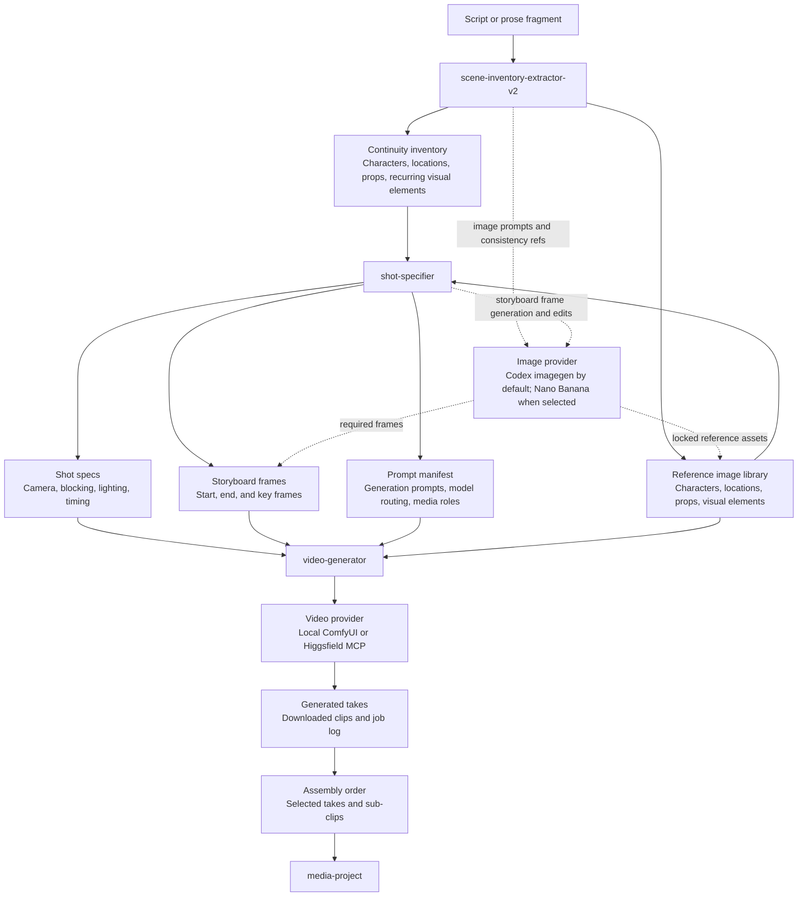

# 🎬 visual-storytelling-skills

[](
https://deepwiki.com/leynos/visual-storytelling-skills)

*Agent skills for AI film production — from prose to picture.*

[](https://raw.githubusercontent.com/leynos/visual-storytelling-skills/main/assets/skill-pack-banner.png)

Every story contains a film. These skills find it. This is a collection
of agent skills, including Codex-compatible execution paths, that walk a
narrative from raw prose through
continuity extraction, reference-image generation, shot direction, and
model-routed video-prompt assembly, with a TTS phoneticizer for good
measure.

______________________________________________________________________

## Why visual-storytelling-skills?

AI video generation is powerful but fussy. Models want precise prompts,
carefully curated references, continuity-checked assets, and shot
direction that could actually be handed to a camera operator. Doing that
by hand for every shot in a feature is a recipe for RSI and despair.

These skills automate the production-prep pipeline:

- **Continuity first**: extract character, location, and prop state
  *before* a single prompt is written, so scenes shot out of order
  stay coherent.
- **Reference-led generation**: build a complete image asset library
  before touching a video model.
- **Model-aware routing**: route shots between Seedance 2.0, Kling 3.0,
  and whatever arrived last Tuesday based on shot type, reference
  availability, and budget.
- **Narration-ready output**: phoneticize proper nouns, brand names, and
  contested acronyms so your TTS engine does not mangle "Siobhán" or
  "df12".

______________________________________________________________________

## Quick start

### Installation

```bash
git clone https://github.com/df12-productions/visual-storytelling-skills
```

### Typical production run

Start with a script or prose fragment. The scene-inventory-extractor
parses it, extracts characters, locations, and props, and generates your
full reference-image library. Its final consistency pass must be acted on
before handoff: fix BLOCK findings, resolve fixable WARN findings, and
turn any remaining WARN findings into explicit shot-specifier
constraints.

```text
$scene-inventory-extractor-v2
```

Hand the resulting inventory to the shot-specifier, which decomposes
every scene into numbered shots with full directorial direction,
storyboard keyframes, and generation-ready video prompts:

```text
$shot-specifier
```

When the prompt manifest and required storyboard frames are ready, use the
video-generator to run local ComfyUI workflows or Higgsfield MCP jobs, monitor
them, collect verified local takes, resume interrupted runs, and write assembly order:

```text
$video-generator
```

When the clips are selected and the assembly order is ready, package
them into an OpenShot project:

```text
$media-project
```

When the narration script is ready, phoneticize it before sending it to
Eleven v3:

```text
$phoneticize
```

Image-generation tasks throughout the pipeline are handled by the historically named
`nanobanana` compatibility skill. It uses Codex built-in imagegen by default and routes
to Nano Banana only when explicitly selected. You can also invoke it directly:

```text
$nanobanana
```

### Overall flow



______________________________________________________________________

## Skills

| Skill | What it does |
|-------|--------------|
| `scene-inventory-extractor-v2` | Reads a script or prose fragment; extracts characters, locations, props, and story state; generates the full reference-image library; produces a continuity inventory for reset-critical scenes. |
| `shot-specifier` | Takes a scene inventory and produces numbered shot specs: actor position and movement, camera mount and motion, lens, lighting, effects, timing, storyboard keyframes, video prompts, and model routing. |
| `video-generator` | Takes the provider-aware prompt manifest and required media from upstream skills; runs local ComfyUI workflows or Higgsfield MCP jobs, monitors them, retrieves verified local takes, resumes interrupted runs, and writes assembly order. |
| `media-project` | Packages selected generated clips into a playable OpenShot `.osp` project with full FFmpegReader metadata. |
| `seedance-2-deep-dive` | Distils Seedance 2.0 operating guidance: multimodal input planning, reference prioritization, duration and aspect defaults, prompt structure, quality/speed tradeoffs, settings sweeps, and failure triage. |
| `kling-3-0-deep-dive` | Distils Kling 3.0 operating guidance: scene structure, camera language, Elements, Motion Control, image-to-video anchors, native audio/dialogue, product prompting, settings sweeps, and failure triage. |
| `nanobanana` | Historical compatibility name for continuity-aware image generation. Uses Codex built-in imagegen by default and Nano Banana only when explicitly selected. |
| `phoneticize` | Detects pronunciation hazards in TTS scripts; suggests phonetic respellings; previews via Eleven v3 fragments; emits a phoneticized script and an archived pronunciation table. |

Image-generation skills must not silently switch providers. Codex built-in imagegen is
the default. Local references are inspected before use, accepted outputs are copied
into the story project, and continuity-critical reference failures stop the workflow.

______________________________________________________________________

## Learn more

- [Users' guide](docs/users-guide.md) — workflow diagrams and
  architecture overview
- [AGENTS.md](AGENTS.md) — agent workflow guidelines and conventions
- `skills/*/SKILL.md` — full workflow documentation for each skill
- `skills/*/references/` — supporting reference documents loaded
  automatically at the relevant phase of each workflow
- `notes/` — research logs, model-routing evidence, and open questions

______________________________________________________________________

## Licence

ISC — see [LICENSE](LICENSE) for details.

______________________________________________________________________

## Contributing

Contributions welcome. See [AGENTS.md](AGENTS.md) for conventions and
workflow guidelines.
